<h1 align="center"> MONITORIZACIÓN DE ALMACENAMIENTO </h1>
 
 

## DIRECTORIOS ENLAZADOS  
  
  
 
 
 
*En este repositorio muestro cuatro comandos útiles a la hora de monitorear el almacenamiento*
 

## COMANDO DF  

El comando *__"df"__* informa sobre el uso del espacio en disco de los sitemas de archivos montados. Los ejemplos que elegí son los siguientes:  
 
> df -h
>
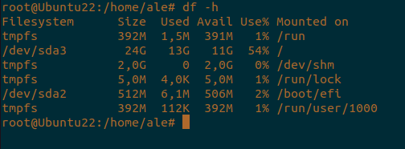  
*__Este comando muestra el uso del espacio en disco en formato legible__*
 
> df -T
>
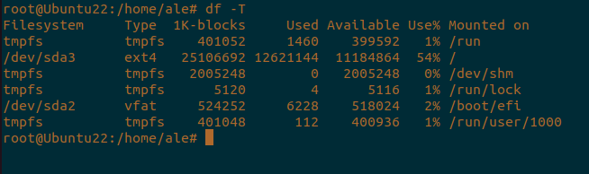  
*__Este comando indica el tipo de sistema de archivos junto con el espacio utilizado__*
 
> df "directorio"
>
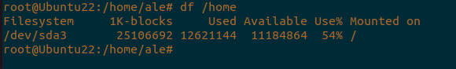  
*__Este comando detalla el uso de disco del sistema de archivos donde está montado el directorio indicado__*
 

## COMANDO DU  

El comando *__"du"__* muestra el uso del espacio en disco por archivos y directorios. Las diferentes variantes del comando que elegí fueron:  
 
> du -h
>
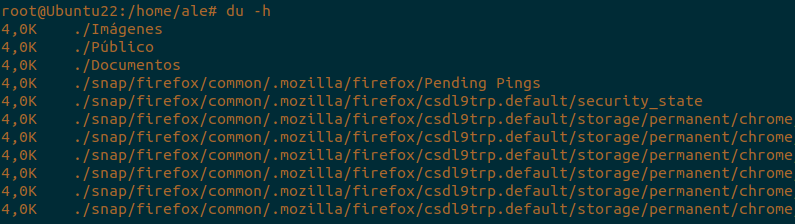  
*__Este comando muestra el tamaño de los directorios en un formato legíble__*
 
> du -sh "ruta"
>
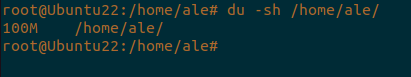  
*__Este comando resume el uso de espacio de un archivo oo directorio específico__*  
 
> du --max-depth=1
>
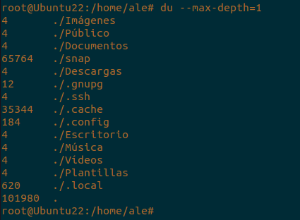  
*__Este comando muestra el tamaño de directorios en el nivel superior de una jerarquía__*  
 

## COMANDO LSBLK  

El comando *__"lsblk"__* lista la información de dispositivos de bloques, como discos y particiones. Los que me parecieron más interesantes fueron:  
 
> lsblk
>
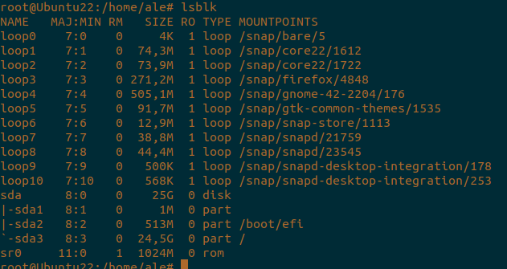  
*__Este comando lista todos los dispositivos de bloques y su jerarquía__*  
 
> lsblk -f
>
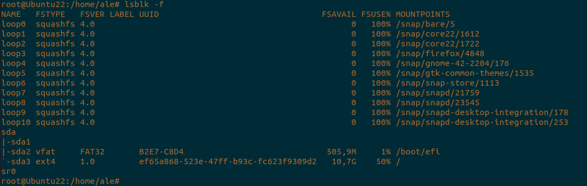  
*__Este comando incluye información del sistema de archivos__*  
 
> lsblk -o NAME,SIZE,TYPE,MOUNTPOINT
>
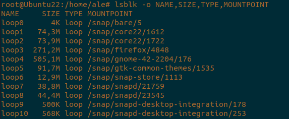  
*__Este comando personaliza las columnas en la salida__*  
 

## COMANDO MOUNT  

El comando *__"mount"__* muestra sistemas de archivos montados y permite montarlos o desmontarlos. A mi parecer los mejores son:  
 
> mount
>
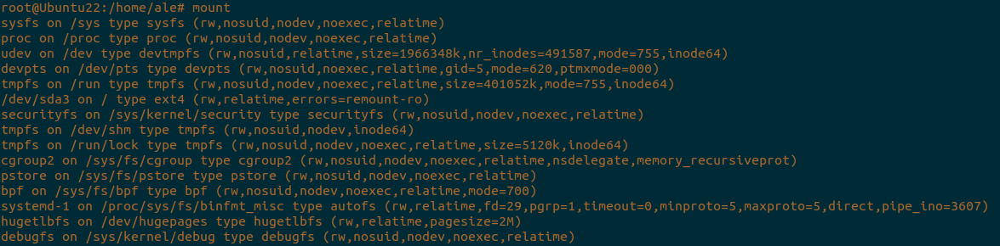  
*__Este comando lista todos los sistemas de archivos actualmente montados__*  
 
> mount | grep "disco deseado/partición deseada"
>
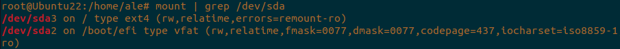  
*__Este comando te filtra el resultado de una partición específica__*  
 
> mount -o remount,rw /
>
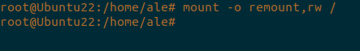  
*__Este comando remonta el sistema de archivos raíz como lectura-escritura__*  
 

