<h1 align="center"> MONITORIZACIÓN DE PROCESOS </h1>
 
 

## DIRECTORIOS ENLAZADOS  
  
  
 
 
 

*En este repositorio mostraré cuatro comandos que me parecieron interesantes a la hora de monitorear procesos*  
   

## COMANDO PS

El comando *"__ps__"* proporciona una instantánea de los procesos en ejecución en el sistema. Los ejemplos que pongo son los siguientes:  
 
> ps -e
>

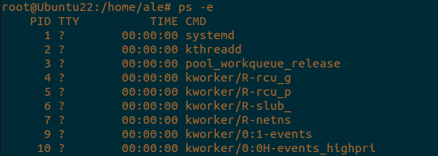  
*__Este comando lista todos los procesos en ejecución__*  
 
> ps aux
>
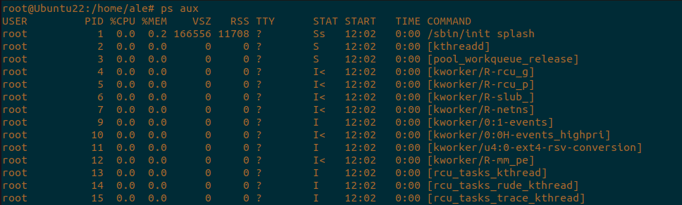  
*__Este comando muestra detalles de todos los procesos, incluyendo el uso de memoria y el de la CPU__*  
 
> ps -u
>
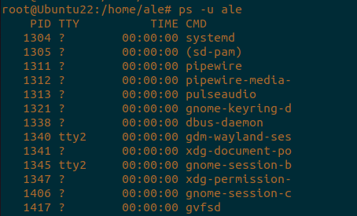  
*__Este comando lista los procesos específicos de un usuario__*  
 
## COMANDO TOP  

El comando *__"top"__* muestra información dinámica sobre los procesos en ejecución y el uso del sistema como CPU, memoria y el tiempo de actividad. A continuación muestro los ejemplos que he seleccionado:  
 
> top
>
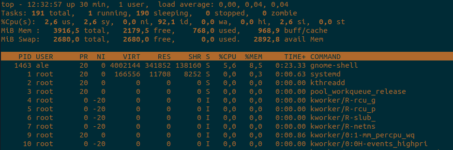  
*__Este comando inicia el monitoreo en tiempo real de procesos__*
 
> top -u
>
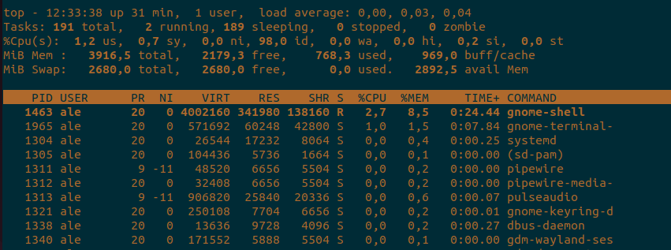  
*__Este comando filtra la lista para mostrar solo los procesos de un usuario específico__*  
 
> htop
>
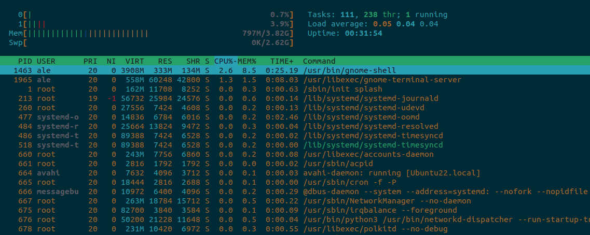  
*__Este comando es una alternativa más avanzada y más amigable que el "top", eso si, requiere de una instalación__*  
 
## COMANDO PIDSTAT  

El comando *__"pidstat"__* muestra estadísticas sobre el uso de recursos por procesos específicos. Los ejemplos que elegí fueron estos:  
 
> pidstat
>
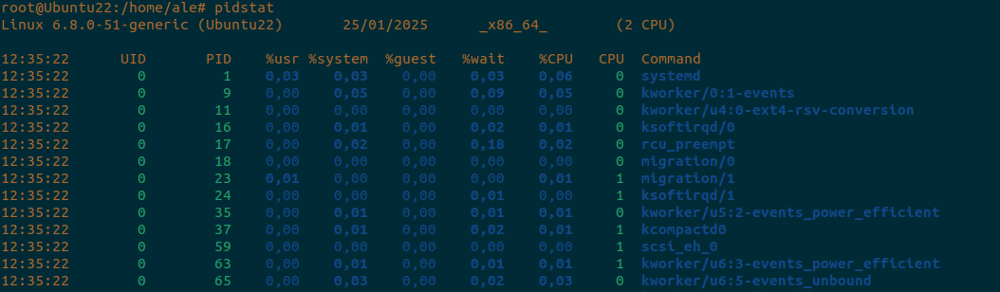  
*__Este comando muestra las estadísticas generales de CPU por proceso__*  
 
> pidstat -r
>
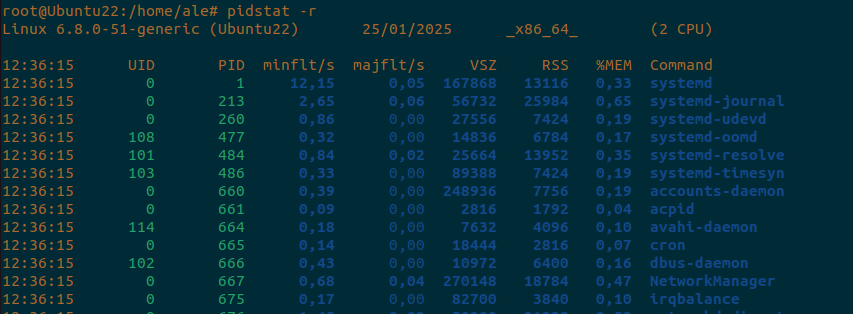  
*__Este comando monitorea el uso de memoria de los procesos__*   
 
> pidstat -u -p
>
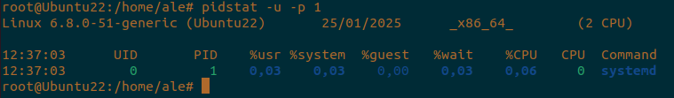  
*__Este comando muestra estadísticas específicas de CPU para un proceso en concreto__*
 
## COMANDO PGREP  

El comando *__"pgrep"__* permite buscar procesos por nombre y devuelve sus PIDs. Los que seleccioné fueron:  
 
> pgrep
>
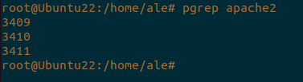  
*__Este comando encuentra los procesos relacionados con el servicio que desees, en este caso Apache__*  
 
> pgrep -u
>
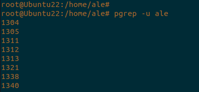  
*__Este comando busca procesos ejecutados por un usuario en concreto__*  
 
> pgrep -fl
>
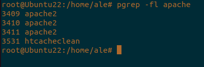  
*__Este comando muestra el nombre coompleto del proceso junto con su PID__*  
 
 

