<h1 align="center"> MONITORIZACIÓN DE RED </h1>
 
 

## DIRECTORIOS ENLAZADOS  
  
  
  
 
 

*En este repositorio traigo los comandos que más me llamaron la atención en cuanto a monitoreo de la red*
 
 

## COMANDO IFCONFIG  

El comando *__"ifconfig"__* muestra la configuración de la red de las interfaces. Aunque está en desuso en algunas distribuciones sigue siendo importante. Los más remarcables son:  
 
> ifconfig
>
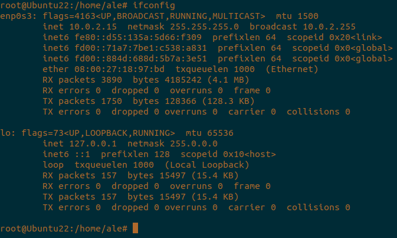  
*__Este comando muestra todas las interfaces de red activas__*
 
> ip a
>
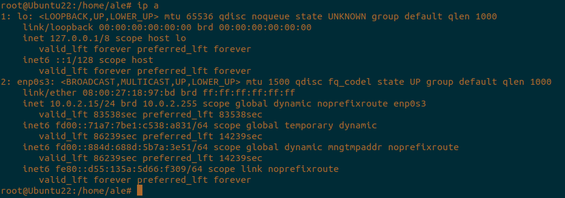  
*__Alternativa moderna y, actualmente la que se usa, para mostrar las interfaces de red__*
 
> ip -s link
>
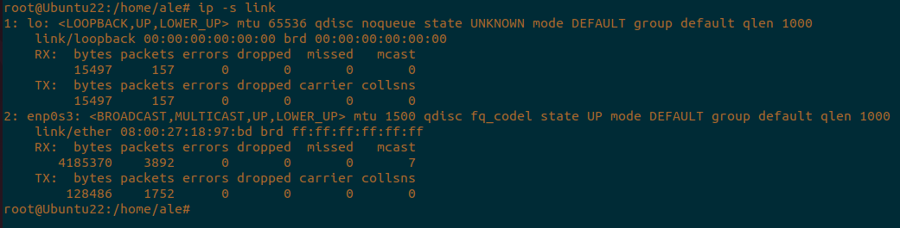  
*__Este comando muestra las estadísticas de las interfaces de red__*
 

## COMANDO NETSTAT  

El comando *__"netstat"__* proporciona información sobre conexiones de red, tablas de enrutamiento y estadísticas de tráfico. A mi criterio los que más usos tendrían son:  
 
> netstat -tuln
>
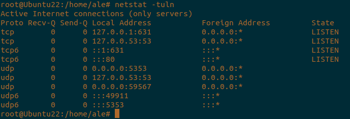  
*__Este comando lista las conexiones activas y puertos en escucha__*  
 
> netstat -i
>
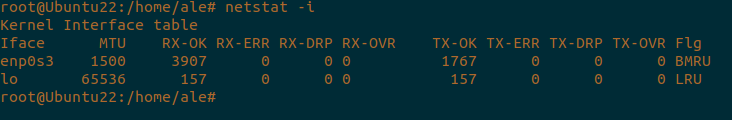  
*__Este comando muestra las estadísticas de las interfaces de red__*
 
> ss -tuln
>
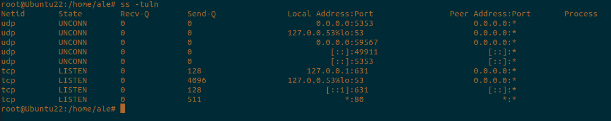  
*__Este comando es la alternativa moderna para listar sockets en escucha__*
 

## COMANDO PING  

El comando *__"pìng"__* verifica la conectividad de red con otro host mediante el envío de paquetes ICMP. Los más usados son:  
 
> ping "dirección"
>
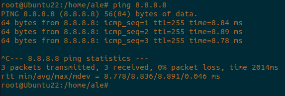  
*__Este comando envía paquetes ICMP al host especificado__*  
 
> ping -c 4 "dirección"
>
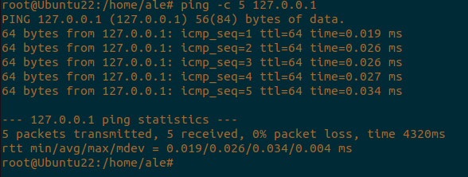  
*__Este comando limita el numero de paquetes enviados, en este caso 4__*  
 
> ping -i 2 "dirección"
>
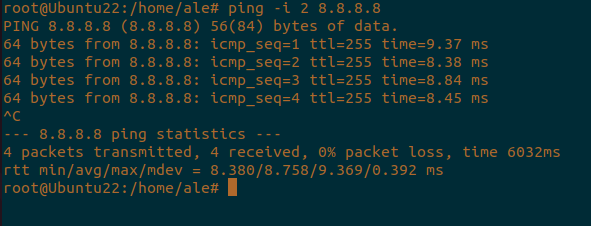  
*__Este comando ajusta el intervalo entre paquetes a 2 segundos__*  
 

## COMANDO TRACEROUTE  

El comando *__"traceroute"__* muestra la ruta que siguen los paquetes para llegar a un host. Dentro del manual de Linux, los más usados son:  
 
> traceroute "dirección"
>
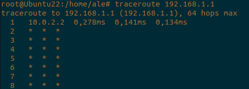  
*__Este comando muestra la ruta por defecto hacia la dirección introducida__*
 
> traceroute -I "dirección"
>
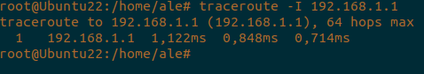  
*__Este comando usa paquetes ICMP en lugar de UDP__*  
 
> traceroute -m 5 "dirección"
>
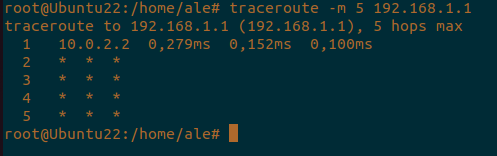  
*__Este comando limita el número de saltos a 5__*
 
